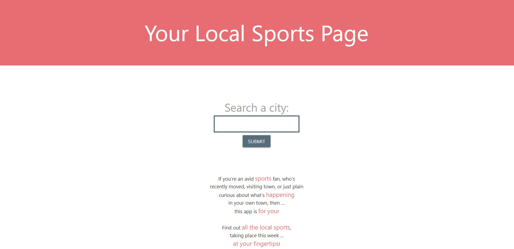
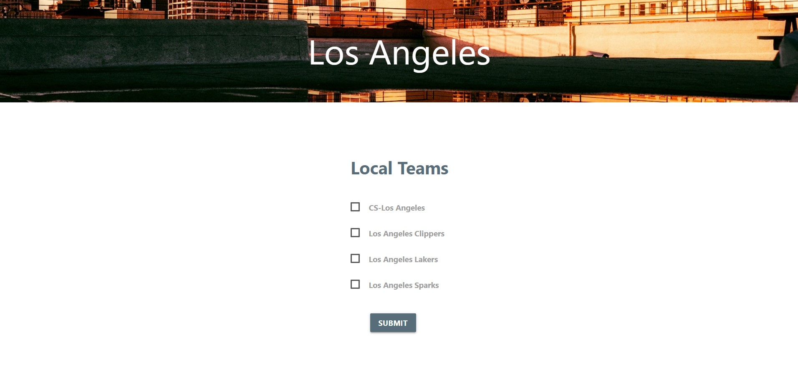
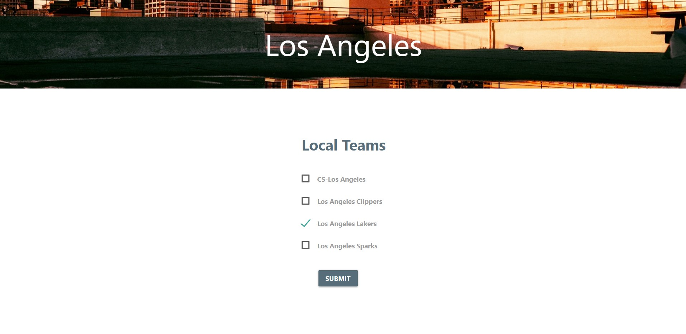
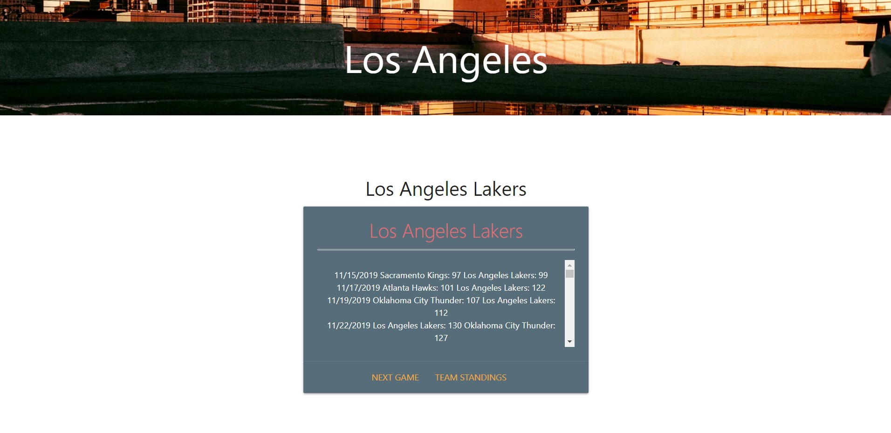

# My Sports Page

For sports fans, especially ones new to a city, it would be extremely useful to see all information related to the major local sports teams in one convenient dashboard. Users can enter their city of choice, then select filters that make finding the information they're interested in (i.e. next game, schedule, standings) super easy to find.

## Walkthrough

The user starts with a blank slate. They see our instructions and our explanation of the application: 




The user enters their desired city info, which goes to our iSports API to filter through the response to narrow the information down to the teams that the user wants:




The app finds the user input city, call on a nice API to put a pretty picture of said city into the header and gives the user of all the local sports going on in their city:




Once the user submits their choices, the next screen presents options of what kind of data they want to see about their chosen teams:


Then the user submits again and they are presented a page with all the data for all the teams they requested!




We used Materialize framework for styling.

In order to restart, for now the user must refresh the page. 

## User Story

```
AS AN avid sports fan
I WANT to know about all the local sports teams
SO THAT I can find out what the local sports schedules are
```

## Acceptance Criteria

```
GIVEN that I want to know what major sports teams are playing this weekend, and what their standings are

WHEN I enter a city name
THEN I'm presented with a check list of local teams with league information (i.e. NBA, MLS, NHL, etc.) that I can select from

WHEN I select which team(s) I'm interested in getting more information on
THEN I'm presented with a check list of possible team information filters (i.e. next game, schedule, standings, etc.)

WHEN I select my desired information type(s)
THEN I'm presented with that specific information for the team(s) I'm interested in
```
